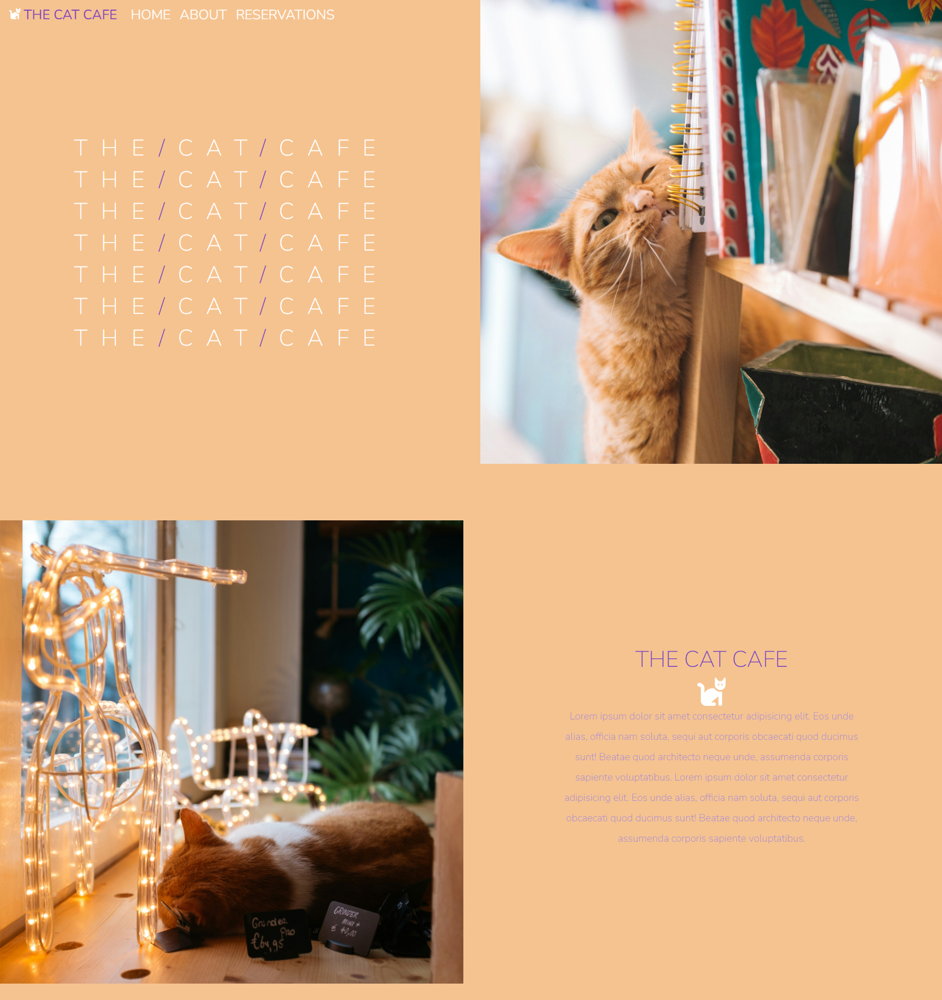
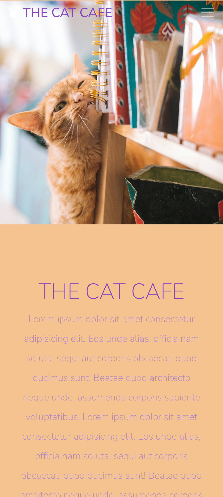

# The Cat Cafe - A Bootstrap Project

## Overview

Hello😊👋

This is a static sample one-page website that I created with Bootstrap for the Web Developer Bootcamp 2023 by Colt Steele on Udemy, based on his "Museum of Candy" project.

It was created mainly using Bootstrap and tweaking and customizing using CSS. 

I decided I wanted to put my own spin on things and since I love cats, the Museum of Candy
became The Cat Cafe.

All pictures were found on Unsplash except for the cat icon that was found on Fontawesome.

The page is responsive and compatible with a variety of screen sizes.

## Link
Visit the live page [here]().

## Screenshots

### Desktop

### Tablet

### Mobile

## Resources
[Bootstrap Docs](https://getbootstrap.com/docs/5.3/getting-started/introduction/)

[Unsplash](https://unsplash.com/)

[Fontawesome](https://fontawesome.com/)

[Udemy](https://www.udemy.com/)
